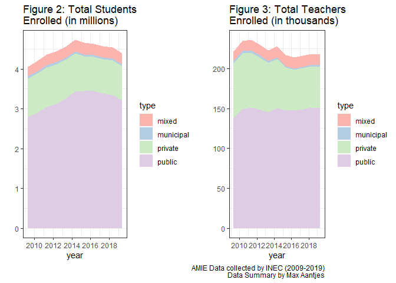
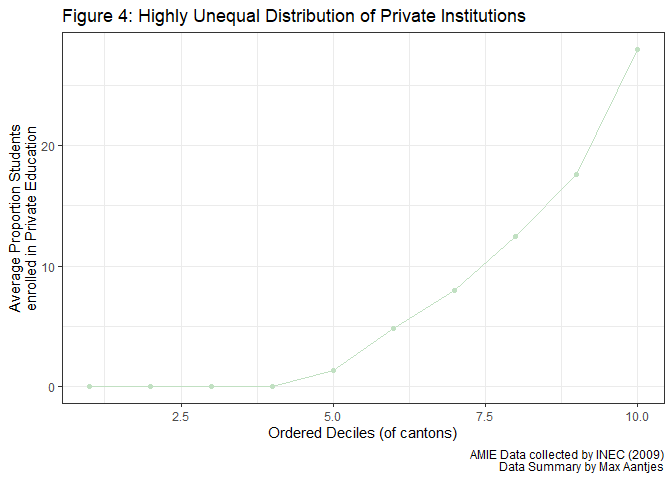
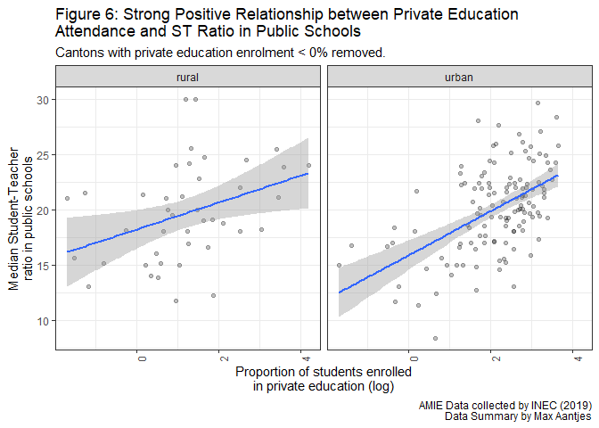
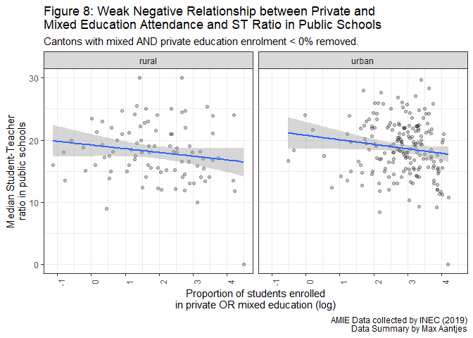

```{r setup, include=FALSE}
knitr::opts_chunk$set(echo = TRUE)
```

## Introduction
As a result of COVID-19, a high number of students in the Latin American school system are transitioning from private education to public education. This repository provides a brief analysis of the potential effect of this transition in Ecuador and explores potential policy recommendations. In particular, it investigates the relationship between Student Teacher Ratios (ST ratio) in public schools and the proportion of students enrolled in different types of education institutions (public, private and mixed). Here, an increase of the ST ratio is assumed to have a negative effect on the quality of education.

* **Brief Paper**: A short paper which provides (i) the context of the analysis; (ii) the detailed presentation of the results and conclusion of the analysis; and (iii) the sources used. This file is available [here](https://github.com/MaxAantjes/Exp-Analysis-Dropout-EDU-EC-COVID19/blob/master/brief-paper.md). 
* **Appendix**: A code and text file which (i) contains all code to generate the results; (ii) gives justifications for the performed computations where relevant; (iii) lists the variables used and their interpretations in code book tables. This file is available [here](https://github.com/MaxAantjes/Exp-Analysis-Dropout-EDU-EC-COVID19/blob/master/appendix.md). 

The subsequent sections provide a short summary of the data set used and the results. For more detailed information, the reader is referred to the files above, as well as the references made within those files. 

## Objectives
The analysis consists of two complementary parts:  

* **Explorative Analysis**: This part aims to answer the following questions: How have ST ratios varied historically? How have they reacted to fluctuations in student enrolment in different types of education? How is enrolment in different types of education distributed across Ecuador?

* **OLS Regression**: Based on the explorative analysis, the relationship between private education enrolment and ST ratio in public education is explored. As we are dealing with census data (no time-regression), null-hypotheses are not relevant here.

## Data Source
The data used is the AMIE survey conducted by INEC (non-summarised). This annual survey collects census data on the number of students and teachers at each Ecuadorian primary and secondary institution. Code books and methodology documents are available in this [online repository](https://educacion.gob.ec/amie/). The data collection period spanned from 2009 to 2019. Data was collected at both the start and end of the academic year. As we are not concerned with drop outs, only the start of the academic year data will be considered in this analysis.

## Results
### Explorative Data Analysis
Figure 1 graphs the median ST ratio of Ecuadorian schools for different types of education between 2009 and 2019. It demonstrates that the ST ratios increased steadily from 2010 to 2014 in public schools, after which they dropped again. Figure 2 and figure 3 summarise the total number of students and teachers for this period per education type. Figure 2 indicates that the ST ratio was paired with an increase in the number of public students, as well as a small decrease in private school students. Figure 3 demonstrates that during this time, the number of public school teachers stagnated.

This suggests that teacher supply in the public school sector is highly inelastic to an increase in the demand for teachers (a rise in the number of students). If this is true, then a transition of students from private schools to public schools will cause a rise in the ST ratio in public schools unless the government intervenes more than it has done in prior years.




Figure 4 shows that the distribution of private institutions is highly unequal. It graphs the average proportion of private education enrolment at cantonal (parish) of 10 ordered deciles in 2009. The 4 bottom deciles of cantons had no private schools at all, the bottom 6 deciles had less than 10% of students enrolled in education and the top decile had on average 28% of students enrolled in private education. This means that a transition from private to public education will impact some cantons more than others:  

(1) Regression analysis can be performed to test whether cantons with higher proportions of private education enrolment actually have higher ST ratios in public schools;  
(2) Government policy regarding the transition from private to public education should focus on particular areas.



### OLS Regression Analysis

Figure 6 regresses the ST ratio in public schools against the log of the private school proportion per canton. The data is also segregated by rural and urban area. In urban cantons with positive private school enrolment, there is a strong positive relationship (see Figure 6). The coefficient equals 1.982377. This means that if a canton A’s proportion of private students is 100% higher than that of canton B (e.g. 5% and 10%), then we expect the ST ratio to be 1 unit higher in canton A, or in other words, for there to be 1 more student for every teacher in canton A. The R squared value equals 0.27, meaning 27% of the variation of ST ratios (of cantons with positive private education enrolment) can be explained by the OLS model. Furthermore, OLS appears to be an appropriate fit, as the residuals are homoscedastic.



*Prima facie* these results are extremely surprising: an increase in the amount of students enrolled in private education is associated with higher public school ST ratios. However, the positive relationship disappears (and becomes slightly negative) if the same regression is performed on the sum of the proportion of students in private **and mixed** education (see Figure 8). This is also surprising, because we would expect semi-private education enrolment to have the same effect as entirely-private education enrolment: they should both reduce the number of students in the public school system. So what is going on here? 



One possible explanation that the size of the student population acts as a confounding variable. Figure 9, supports this assumption. It plots the ST ratio in public schools in a canton against the total number of students in that canton. Cantons with a high level of mixed institutions (blue) are associated with low numbers of students and a low ST ratio. Cantons with a high level of private institutions (red) are associated with high numbers of students and a high ST ratio. The conclusion we can draw from the data is thus not a strong positive or negative effect of private education enrolment on ST ratios. Instead, it is the effect of population size on the type of educational institutions that are prevalent in the area.


The conclusion we can draw from the data is thus not the effect of private education enrolment on ST ratios. Instead, it is the effect of population size on the type of educational institutions that are prevalent in the area.

## Policy Implications

There are at least two policy conclusions that can be drawn from the results:  

1. The number of teachers in public education tend to be unresponsive to the demand of teachers. Given the increase of public school enrolment in Ecuador, this means government should introduce new policies to encourage public teacher hiring.  
2. Policy makers should be aware of the different types of private education in Latin America and their concentration. Purely private institutions (instituciones fiscales) tend to concentrate in large cities, where ST ratios also tend to be high. Semi-private institutions (instituciones fiscomisionales) tend to concentrate in lesser populated areas, where ST ratios tend to be low. To avoid a rise in ST ratios, government policy should thus focus on reducing the transition to public institutions from **entirely** private institutions.

## References

IADB (2018). *Private schooling in Latin America*. Available from: [https://publications.iadb.org/publications/english/document/Private-Schooling-in-Latin-America-Trends-and-Public-Policies.pdf]
