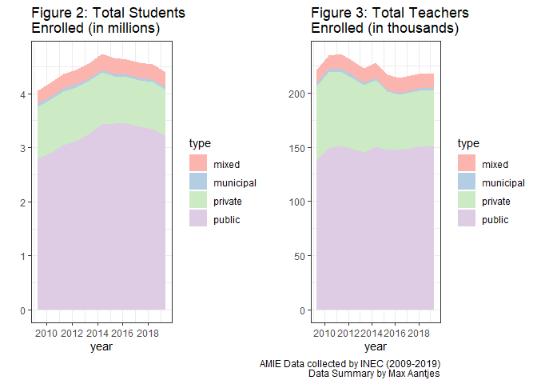
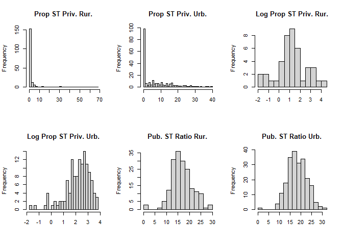
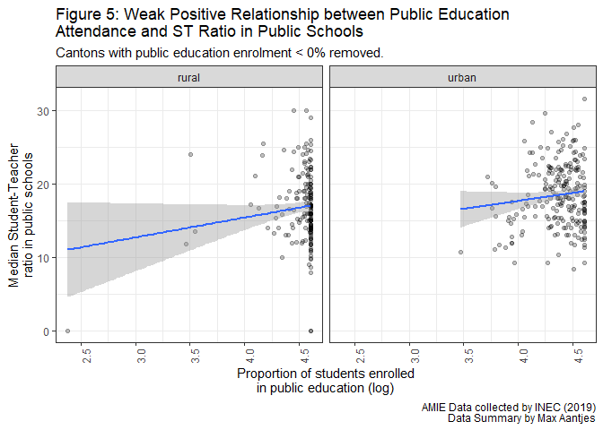
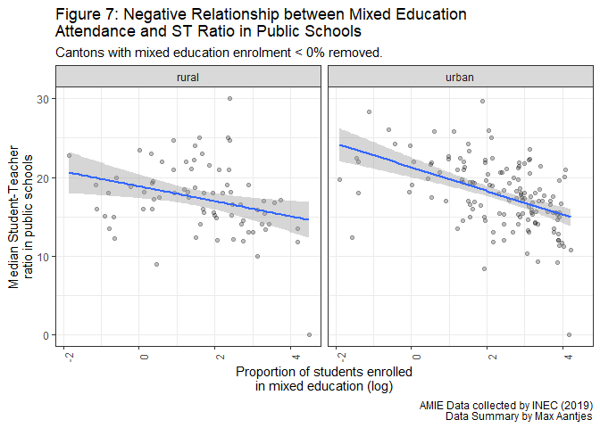
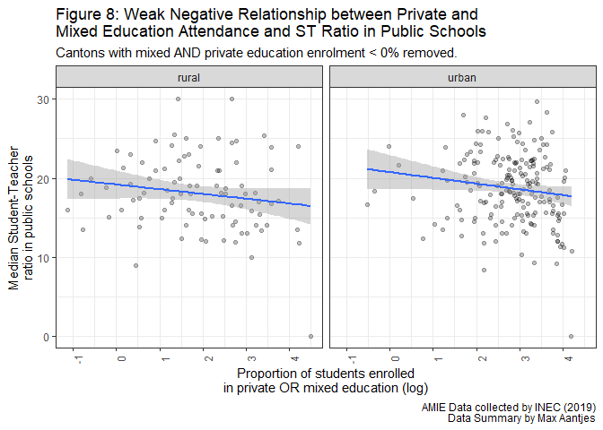
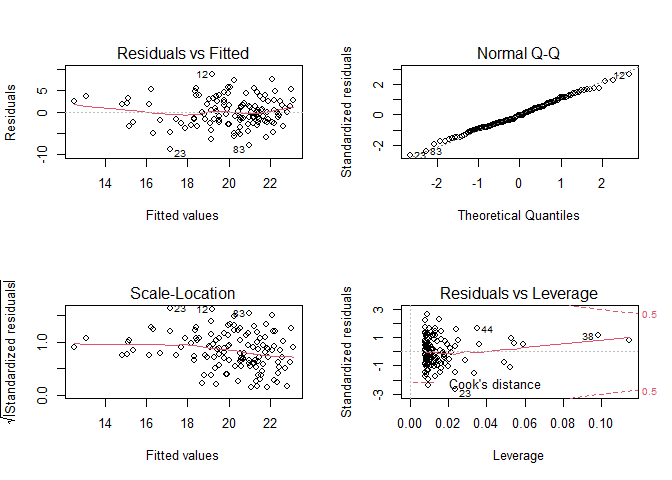

Appendix
================
Max Aantjes
15/09/2020

  - [Introduction](#introduction)
  - [R Packages](#r-packages)
  - [Context of Data Sets](#context-of-data-sets)
  - [Download of Data Set](#download-of-data-set)
  - [Data Cleaning](#data-cleaning)
  - [Manipulation of the Data](#manipulation-of-the-data)
  - [Results](#results)
      - [What happened to the ST ratio with past fluctuations in
        enrollment?](#what-happened-to-the-st-ratio-with-past-fluctuations-in-enrollment)
      - [How is private institution enrolment distributed amongst
        cantons?](#how-is-private-institution-enrolment-distributed-amongst-cantons)
      - [What is the relationship between enrollment proportions and ST
        ratios in public
        schools?](#what-is-the-relationship-between-enrollment-proportions-and-st-ratios-in-public-schools)

# Introduction

The following sections contain all computations for the creation of the
exploratory data results summarised in the brief paper. Computations are
accompanied by references and justifications to clarify any choices
made.

# R Packages

The following R packages are used in the subsequent code sections.

``` r
library(openxlsx)
library(stringr)
library(tidyverse)
library(kableExtra)
```

    ## Warning: package 'kableExtra' was built under R version 4.0.2

``` r
library(RColorBrewer)
library(ggplot2)
library(gridExtra)
```

The following code loads a useful function to account for special
characters.

``` r
rep_sp_char <- function(x){
        sp_char <- c("á", "é", "í", "ó", "ñ")
        rep <- c("a", "e", "i", "o", "n")
        for(i in 1:length(rep)){
                x <- gsub(sp_char[i], rep[i], x)}
        return(x)}
```

# Context of Data Sets

The data used is the AMIE survey conducted by INEC (non-summarised).
This annual survey collects census data on the number of students and
teachers at each Ecuadorian primary and secondary institution. Code
books and methodology documents are available in this [online
repository](https://educacion.gob.ec/amie/). The data collection period
spanned from 2009 to 2019. Data was collected at both the start and end
of the academic year. As we are not concerned with drop outs, only the
start of the academic year data will be considered in this analysis.

# Download of Data Set

The following code downloads the data.

``` r
y2009s <- "https://educacion.gob.ec/wp-content/plugins/download-monitor/download.php?id=10555"
y2010s <- "https://educacion.gob.ec/wp-content/plugins/download-monitor/download.php?id=10557"
y2011s <- "https://educacion.gob.ec/wp-content/plugins/download-monitor/download.php?id=10559"
y2012s <- "https://educacion.gob.ec/wp-content/plugins/download-monitor/download.php?id=10561"
y2013s <- "https://educacion.gob.ec/wp-content/plugins/download-monitor/download.php?id=12176"
y2014s <- "https://educacion.gob.ec/wp-content/plugins/download-monitor/download.php?id=10567"
y2015s <- "https://educacion.gob.ec/wp-content/plugins/download-monitor/download.php?id=10569"
y2016s <- "https://educacion.gob.ec/wp-content/plugins/download-monitor/download.php?id=10573"
y2017s <- "https://educacion.gob.ec/wp-content/plugins/download-monitor/download.php?id=12645"
y2018s <- "https://educacion.gob.ec/wp-content/plugins/download-monitor/download.php?id=15711"
y2019s <- "https://educacion.gob.ec/wp-content/plugins/download-monitor/download.php?id=15713"

l1 <- list(y2009s, y2010s, y2011s, y2012s, y2013s, y2014s, y2015s, y2016s, y2017s)

dfl1 <- lapply(l1, read.xlsx, sheet = 1, startRow = 11)
dfl2 <- read.xlsx(y2018s, sheet = 2, startRow = 13)
dfl3 <- read.xlsx(y2019s,  sheet = "Registros Administrativos", startRow = 13)

dfl1_1 <- do.call(rbind, dfl1)

select_cols <- function(x){
        names(x) <- tolower(rep_sp_char(names(x)))
        z <- x %>%
                select(periodo, total.estudiantes, total.docentes, provincia,
                       nombre.institucion, zona.inec, sostenimiento, canton,
                       nivel.educacion)
        return(z)}

dfl1_2 <- select_cols(dfl1_1)
dfl2_1 <- select_cols(dfl2)

names(dfl3) <- tolower(rep_sp_char(names(dfl3)))
names(dfl3)[2] <- "duplicate"
dfl3_1 <- dfl3 %>%
                select(-duplicate) %>%
                select(periodo, "total.estudiantes" = 34, total.docentes, provincia,
                       nombre.institucion, zona.inec, sostenimiento, canton,
                       nivel.educacion)

df <- rbind(dfl1_2, dfl2_1, dfl3_1)
```

# Data Cleaning

The following code selects the columns of interests, translates them and
turns them into factors. It should be noted here that column 35 (which
is selected) **only** counts students enrolled in primary and secondary
education. It also transforms the year variable into a date variable.

``` r
not.of.interest <- c("Alfabetización P.P", "Artesanal P.P", "Formación Artística", "No escolarizado", "No registrado")
df1 <- df %>%
        select("year" = periodo, "name" = nombre.institucion, "area" = zona.inec, 
               "province" = provincia, "canton" = canton, "type" = sostenimiento,
               "tot.teachers" = total.docentes, "tot.students" = total.estudiantes,
               nivel.educacion) %>%
        mutate(type = factor(tolower(gsub(" ", "", type)), 
                             levels = c("municipal", "fiscomisional", "particular", 
                                        "particularlaico", "particularreligioso", "fiscal"),
                             labels = c("municipal", "mixed", "private", "private", 
                                        "private", "public"),
                             ordered = TRUE)) %>%
        mutate(area = factor(str_remove(area, "INEC"), 
               levels = c("Rural", "Urbana"), labels = c("rural", "urban"))) %>%
        mutate(canton = factor(tolower(canton))) %>%
        mutate(province = factor(tolower(province))) %>%
        mutate(year = str_extract(year, "^[0-9]{4}")) %>%
        mutate(year = as.Date(paste0(year, "-05-01"))) %>%
        filter(!nivel.educacion %in% not.of.interest) %>%
        select(-nivel.educacion)
```

The following code book explains the different variables in detail:

<table>

<caption>

Code Book data frame DF1

</caption>

<thead>

<tr>

<th style="text-align:left;">

colnames

</th>

<th style="text-align:left;">

explanation

</th>

<th style="text-align:left;">

values

</th>

</tr>

</thead>

<tbody>

<tr>

<td style="text-align:left;">

year

</td>

<td style="text-align:left;">

Indicates the school year (as data pertains to the start of the school
year, the date is set to the First of May (roughly the start of the
Ecuadorian schoolyear at the coast).

</td>

<td style="text-align:left;">

Date

</td>

</tr>

<tr>

<td style="text-align:left;">

name

</td>

<td style="text-align:left;">

Institution name

</td>

<td style="text-align:left;">

ID as characters

</td>

</tr>

<tr>

<td style="text-align:left;">

area

</td>

<td style="text-align:left;">

Indicates whether the institution is in a rural or urban area.

</td>

<td style="text-align:left;">

factor of 2 levels: rural, urban

</td>

</tr>

<tr>

<td style="text-align:left;">

type

</td>

<td style="text-align:left;">

Indicates how the institution is financed

</td>

<td style="text-align:left;">

factor of 4 levels: public, …

</td>

</tr>

<tr>

<td style="text-align:left;">

canton

</td>

<td style="text-align:left;">

Ecuadorian canton name.

</td>

<td style="text-align:left;">

factor of 222 levels: LOJA, …

</td>

</tr>

<tr>

<td style="text-align:left;">

tot.teachers

</td>

<td style="text-align:left;">

Total number of teachers at the institution

</td>

<td style="text-align:left;">

numeric

</td>

</tr>

<tr>

<td style="text-align:left;">

estimated.5-19.yo

</td>

<td style="text-align:left;">

Total number of students at the institution

</td>

<td style="text-align:left;">

numeric

</td>

</tr>

<tr>

<td style="text-align:left;">

education.level

</td>

<td style="text-align:left;">

The levels of education provided by the institution

</td>

<td style="text-align:left;">

factor of 18 levels, numbers assigned alphabetically

</td>

</tr>

</tbody>

</table>

# Manipulation of the Data

The following code creates a data frame which calculates the median
student-teacher ratio for each canton (rural and urban area). It then
creates a data frame which calculates the percentage of students which
are enrolled in private schools per canton (rural and urban area). These
two variables will be used for OLS regressions. Finally, the two data
frames are merged.

``` r
missing_to_zero <- function(var){return(ifelse(is.na(var), 0, var))}

total <- df1 %>%
            filter(tot.students > 10 & tot.teachers > 0) %>%
            group_by(year, type) %>%
            summarise_at(.vars = c("tot.students", "tot.teachers"), .funs = sum) %>%
            mutate(name = "total") %>%
            mutate(area = "total") %>%
            mutate(province = "total") %>%
            mutate(canton = "total") 

df2 <- rbind(df1, total)

st_calc <- function(x) {
        z <- x %>%
            filter(tot.students > 10 & tot.teachers > 0) %>%
            mutate(stratio = tot.students/tot.teachers) %>%
            summarise(med.stratio = median(stratio), 
                         sum.students = sum(tot.students),
                         sum.teachers = sum(tot.teachers))
        return(z)}

dfprov <- st_calc(df2 %>% group_by(year, province, type)) 
dfcan <- st_calc(df2 %>% group_by(year, canton, type, area))

prop_calc <- function(x, y, q){
        z <- x %>%
            summarise(n = sum(tot.students)) %>%
            pivot_wider(names_from = type, values_from = n) %>%
            mutate(public = missing_to_zero(public)) %>%
            mutate(mixed = missing_to_zero(mixed)) %>%
            mutate(municipal = missing_to_zero(municipal)) %>%
            mutate(private = missing_to_zero(private)) %>%
            mutate(total = public + mixed + municipal + private) %>%
            mutate(public = (public/total)*100) %>%
            mutate(mixed = (mixed/total)*100) %>%
            mutate(municipal = (municipal/total)*100) %>%
            mutate(private = (private/total)*100) %>%
            pivot_longer(cols = c(public, mixed, municipal, private), 
                         values_to = "prop.students", names_to = "type") %>%
            select(-total) %>%
            left_join(y, by = q) %>%
            mutate(med.stratio = missing_to_zero(med.stratio)) %>%
            mutate(sum.students = missing_to_zero(sum.students)) %>%
            mutate(sum.teachers = missing_to_zero(sum.teachers)) %>%
            ungroup()
        return(z)}

dfprov1 <- prop_calc(x = df2 %>% group_by(year, province, type), 
                     y = dfprov, q = c("year", "province", "type"))
```

    ## Warning: Column `type` joining character vector and factor, coercing into
    ## character vector

``` r
dfcan1 <- prop_calc(x = df2 %>% group_by(year, canton, type, area), 
                     y = dfcan, q = c("year", "canton", "type", "area"))
```

    ## Warning: Column `type` joining character vector and factor, coercing into
    ## character vector

The following code book explains the different variables in detail for
the `dfprov1` data frame:

<table>

<caption>

Code Book data frame dfprov1

</caption>

<thead>

<tr>

<th style="text-align:left;">

colnames

</th>

<th style="text-align:left;">

explanation

</th>

<th style="text-align:left;">

values

</th>

</tr>

</thead>

<tbody>

<tr>

<td style="text-align:left;">

year

</td>

<td style="text-align:left;">

Indicates the school year (as data pertains to the start of the school
year, the date is set to the First of May (roughly the start of the
Ecuadorian schoolyear at the coast).

</td>

<td style="text-align:left;">

Date

</td>

</tr>

<tr>

<td style="text-align:left;">

province

</td>

<td style="text-align:left;">

Indicates the Ecuadorian province in which the institutions are located.

</td>

<td style="text-align:left;">

Factor of 26 levels: azuay, …

</td>

</tr>

<tr>

<td style="text-align:left;">

prop.students

</td>

<td style="text-align:left;">

Proportion of students enrolled per type of education.

</td>

<td style="text-align:left;">

Numeric

</td>

</tr>

<tr>

<td style="text-align:left;">

med.stratio

</td>

<td style="text-align:left;">

Median Student/Teacher ratio, ratios calculated at school level by
dividing the number of teachers by the number of students

</td>

<td style="text-align:left;">

Numeric

</td>

</tr>

<tr>

<td style="text-align:left;">

sum.students

</td>

<td style="text-align:left;">

Aggregate of all students at all schools (initial to bachelor level)

</td>

<td style="text-align:left;">

Numeric

</td>

</tr>

<tr>

<td style="text-align:left;">

sum.teachers

</td>

<td style="text-align:left;">

Aggregate of all teachers

</td>

<td style="text-align:left;">

Numeric

</td>

</tr>

</tbody>

</table>

The following code book explains the different variables in detail for
the `dfcan1` data frame:

<table>

<caption>

Code Book data frame dfcan1

</caption>

<thead>

<tr>

<th style="text-align:left;">

colnames

</th>

<th style="text-align:left;">

explanation

</th>

<th style="text-align:left;">

values

</th>

</tr>

</thead>

<tbody>

<tr>

<td style="text-align:left;">

year

</td>

<td style="text-align:left;">

Indicates the school year (as data pertains to the start of the school
year, the date is set to the First of May (roughly the start of the
Ecuadorian schoolyear at the coast).

</td>

<td style="text-align:left;">

Date

</td>

</tr>

<tr>

<td style="text-align:left;">

canton

</td>

<td style="text-align:left;">

Indicates the Ecuadorian canton in which the institutions are located.

</td>

<td style="text-align:left;">

Factor of 26 levels: azuay, …

</td>

</tr>

<tr>

<td style="text-align:left;">

area

</td>

<td style="text-align:left;">

The area of the canton in which the institutions are located

</td>

<td style="text-align:left;">

Factor of 2 levels: rural, urban

</td>

</tr>

<tr>

<td style="text-align:left;">

prop.students

</td>

<td style="text-align:left;">

Proportion of students enrolled per type of education.

</td>

<td style="text-align:left;">

Numeric

</td>

</tr>

<tr>

<td style="text-align:left;">

med.stratio

</td>

<td style="text-align:left;">

Median Student/Teacher ratio, ratios calculated at school level by
dividing the number of teachers by the number of students

</td>

<td style="text-align:left;">

Numeric

</td>

</tr>

<tr>

<td style="text-align:left;">

sum.students

</td>

<td style="text-align:left;">

Aggregate of all students at all schools (initial to bachelor level)

</td>

<td style="text-align:left;">

Numeric

</td>

</tr>

<tr>

<td style="text-align:left;">

sum.teachers

</td>

<td style="text-align:left;">

Aggregate of all teachers

</td>

<td style="text-align:left;">

Numeric

</td>

</tr>

</tbody>

</table>

# Results

## What happened to the ST ratio with past fluctuations in enrollment?

The following code summarises the data from the `dfprov1` data frame.
Figure 1 demonstrates that the student teacher ratios rose from 2010 to
2014 in public schools, after which they dropped again. Figure 2 and
Figure 3 demonstrate that this rise in ST ratio mostly arose because of
a rise in public students, as well as a small decrease in private school
students. The main reason for this rise is that the number of teachers
enrolled in public education has turned out to be inelastic to the
increase in public student enrolment.

``` r
p <- ggplot(dat = dfprov1 %>% filter(province == "total"), aes(x = year, y = med.stratio, col = type))
p1 <- p + geom_point() + geom_line() + scale_color_brewer(palette="Pastel1")
p2 <- p1 + theme_bw() + labs(title = "Figure 1: Median Teacher Student Ratio", y = "",
                             caption = "AMIE Data collected by INEC (2009-2019)\nData Summary by Max Aantjes")
p2
```

<!-- -->

``` r
p <- ggplot(dat = dfprov1 %>% filter(province == "total"), aes(x = year, y = sum.students/1000000, fill = type))
p1 <- p + geom_area() + scale_fill_brewer(palette="Pastel1")
p2 <- p1 + theme_bw() + labs(title = "Figure 2: Total Students\nEnrolled (in millions)", y = "",
                             caption = "\n") 
q <- ggplot(dat = dfprov1 %>% filter(province == "total"), aes(x = year, y = sum.teachers/1000, fill = type))
q1 <- q + geom_area() + scale_fill_brewer(palette="Pastel1") 
q2 <- q1 + theme_bw() + labs(title = "Figure 3: Total Teachers\nEnrolled (in thousands)", y = "",
                             caption = "AMIE Data collected by INEC (2009-2019)\nData Summary by Max Aantjes")

grid.arrange(p2, q2, ncol = 2, nrow =1)
```

<!-- -->

## How is private institution enrolment distributed amongst cantons?

The following code orders the cantons in terms of the proportion of
students enrolled in private institutions. It then divides the cantons
across 10 deciles. Finally, it then calculates the average proportion
per decile and graphs it. It demonstrates that private institution
enrolment is highly variable amongst cantons.

``` r
dfcant <- dfcan1 %>%
        filter(year == as.Date("2019-05-01"), area == "urban") %>%
        select(canton, prop.students, type) %>%
        pivot_wider(values_from = prop.students, names_from = type)

dfcant1 <- dfcant %>%
        select(canton, private) %>%
        arrange(private) %>%
        mutate(quantile = ntile(private, 10)) %>%
        group_by(quantile) %>%
        summarise(private = mean(private))

p <- ggplot(data = dfcant1, aes(x = quantile, y = private))
p1 <- p + geom_line(col = "#c1e0c2") + geom_point(col = "#c1e0c2") + theme_bw()
p2 <- p1 + labs(y = "Average Proportion Students\nenrolled in Private Education",
                title = "Figure 4: Highly Unequal Distribution of Private Institutions",
                x = "Ordered Deciles (of cantons)",
                caption = "AMIE Data collected by INEC (2009)\nData Summary by Max Aantjes")
p2
```

<!-- -->

## What is the relationship between enrollment proportions and ST ratios in public schools?

### Hypotheses

Based on the exploration of the data, it seems plausible that the number
of teachers in public education is inelastic to the number of students.
Accordingly, we expect that an increase in private education enrollment
will decrease the ST ratio in public schools (and vice versa).
Accordingly, the analysis attempts to explore the relationship between
private education enrollment and ST ratio in public education is
explored. As we are dealing with census data (no time-regression),
null-hypotheses are not relevant here.

### Specification of Variable Quantifiers

The following code prepares the data frame for further analysis (with a
wider data frame the proportions of different types of education can be
regressed against the ST ratio of different types of education).

``` r
dfcan2019 <- dfcan1 %>%
          filter(year == as.Date("2019-05-01")) %>%
          pivot_wider(names_from = type,
                      values_from = c(prop.students:sum.teachers)) %>%
          filter(canton != "total")
```

For an OLS regression, we are looking for independent and dependent
variables which are normally distributed. The following code tests the
distribution of the two variables (proportion and ST ratio) for urban
and rural areas. It demonstrates that student-teacher ratios are
normally distributed. To the contrary the proportion of private students
is not. Nevertheless, by taking the log, we can generate a distribution
for both areas which approximates a normal. Any 0% proportions were
removed here (as its log generates a negative Infinite number). This is
illustrative for other proportions (the graphs are left out to save
space).

For this reason two decisions are made:

1.  the log version will be used for regression;  
2.  0% proportion will be removed for regression.

This limits the conclusions of the study: the relationship between the
ST ratio and a proportion is only tested in places where that proportion
exceeds 0%. This means the R squared value does not take into account
the variation in the dependent variable in which the independent
variable equals 0. It is thus plausibly overestimated.

``` r
par(mfrow = c(2,3))
hist(dfcan2019$prop.students_private[dfcan2019$area == "rural"], 
     main = "Prop ST Priv. Rur.", xlab = "", breaks = 40)
hist(dfcan2019$prop.students_private[dfcan2019$area == "urban"], 
     main = "Prop ST Priv. Urb.", xlab = "", breaks = 40)
hist(log(dfcan2019$prop.students_private[dfcan2019$area == "rural" & 
                                           dfcan2019$prop.students_private > 0]), 
     main = "Log Prop ST Priv. Rur.", xlab = "", breaks = 20)
hist(log(dfcan2019$prop.students_private[dfcan2019$area == "urban" & 
                                           dfcan2019$prop.students_private > 0]), 
     main = "Log Prop ST Priv. Urb.", xlab = "", breaks = 20)
hist(dfcan2019$med.stratio_public[dfcan2019$area == "rural"], 
     main = "Pub. ST Ratio Rur.", xlab = "", breaks = 20)
hist(dfcan2019$med.stratio_public[dfcan2019$area == "urban"], 
     main = "Pub. ST Ratio Urb.", xlab = "", breaks = 20)
```

<!-- -->

### OLS Regression

The following code creates a graph of the relationship of the two
variables, as well as its OLS regression with the student-teacher ratio
in public schools as the dependent variable and the log of the
proportion of students attending a particular type of institution
(mixed, private and public) as the independent variable. For the
independent variable any proportions of 0% are removed for reasons
specified above.

<!-- --><!-- --><!-- --><!-- -->

As expected, public education enrolment has a positive effect on ST
ratio in public schools. However, the relationship is rather weak and
shows much variation in cantons with close to 100% school enrolment.
Therefore, we will thus focus on the other results.

In cantons with private school enrolment, there is a strong positive
relationship between private education enrolment and the ST ratio in
public schools. Surprisingly, however, mixed school enrolment (which is
semi-private) has a negative relationship on ST ratio in public schools.
How is this possible? We will first explore the OLS regression a bit
further. The following code calculates relevant statistics for the
relationship between private school enrolment and the ST ratio in public
schools.

``` r
dfcan2019urb <- dfcan2019[dfcan2019$prop.students_private > 0,] %>% filter(area == "urban")
r <- lm(formula = med.stratio_public ~ log(prop.students_private), data = dfcan2019urb)
summary(r)$r.squared
```

    ## [1] 0.2774007

``` r
summary(r)$coefficients
```

    ##                             Estimate Std. Error   t value     Pr(>|t|)
    ## (Intercept)                15.857092  0.6780372 23.386759 1.758866e-47
    ## log(prop.students_private)  1.982377  0.2861714  6.927237 2.012148e-10

The results indicate that if an area A’s proportion of private students
is 100% higher than that of area B (e.g. 5% and 10%), then we expect the
ST ratio to be 1 unit higher in area A, or in other words, for there to
be 1 more student for every teacher in area B. The R squared value
indicates that more than 27% of the variation of ST ratios of cantons
**with private institutions can be explained by the OLS model**. The
following plots indicate that the data is roughly homoscedastic. This
suggests OLS regression is appropriate for the data. At first sight,
these results seem sufficient to prove relationship between private
education enrollment and ST ratio in public education.

``` r
par(mfrow = c(2,2))
plot(r)
```

<!-- -->

### Alternative Explanation

However, figure 7 and figure 8 indicate something different might be at
play here. When considering also semi-private institutions, the
relationship turns negative. One possible explanation for this is that
ST ratios could simply be higher in populated areas (large cities) -
which is consistent with the assumption that teacher hiring is rather
inelastic - and that mixed institutions are primarily located in low
population areas, whilst private institutions are primarily located in
high population areas. The distribution of these different institution
might stem from larger inequality in incomes in urban areas (thus
favouring fully private institutions) and a lesser influence by the
Catholic church (which runs most mixed institutions).

The following code tests this explanation by plotting the median ST
Ratio in public schools against the total number of enrolled students
per canton (see Figure 9). It then classifies cantons according to the
amount of students enrolled in mixed and private education. It
demonstrates that ST ratios are higher in areas with a higher population
and that this is where the proportion of private institution enrollment
is high (red). It also demonstrates that ST ratios are lower in areas
with a lower population and that this is where mixed institution
enrollment is high (blue).

``` r
test <- dfcan2019 %>%
        mutate(classification = ifelse(prop.students_mixed >= 5 & prop.students_private <= 5, 
                                       "PMS > 4.9% and PPS < 5%", "PH")) %>%
        mutate(classification = ifelse(prop.students_mixed <= 5 & prop.students_private >= 5, 
                                       "PMS < 5% and PPS > 4.9%", classification)) %>%
        filter(classification != "PH")

p <- ggplot(data = test, aes(x = log(sum.students_public+sum.students_private+sum.students_mixed+sum.students_municipal), 
                                  y = med.stratio_public, col = classification))
p1 <- p + geom_point(alpha = 1/4) + theme_bw()
p2 <- p1 + labs(x = "Total Students in Canton (log)", y = "Median Student-Teacher\nRatio in Public Schools",
                title = "Figure 9: ST Ratio in Public Schools increases\nwith Total Number of Students per Canton",
                subtitle = "PMS = Proportion of Students in Mixed Education\nPPS = Proportion of Students in Private Education",
  caption = "AMIE Data collected by INEC (2019)\nData Summary by Max Aantjes")
p2
```

<!-- --> The
following plots again demonstrate the relationships between mixed and
private enrolment and number of students.

``` r
par(mfrow = c(1,2))
plot(test$prop.students_private, log(test$sum.students_public))
plot(test$prop.students_mixed, log(test$sum.students_public))
```

<!-- -->

Accordingly, the positive relationship between purely private education
enrolment and ST ratios is thus plausibly explained by a confounder
variable: the number of students. When the two types of private
education (pure and mixed) are combined, the expected relationship
dissapears (see figure 8). Neverhteless, the data does highlight that
certain types of educational institutions are located in areas with
higher or lower ST ratios. Government policy can therefore be targeted
at specific types of private education to avoid a rise in ST ratios.
