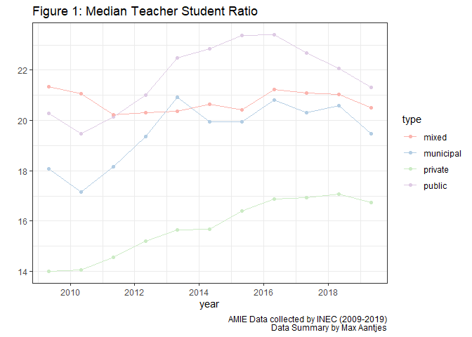

The transition from Private to Public Education in Ecuador: what does it
mean?
================
Max Aantjes
04/10/2020

**At the end of June, the IADB reported that public education enrolment
in the Ecuadorian coastal provinces had increased with 6.5% (Olson,
2020). Last week, Ecuavisa, a major Ecuadorian Television Network
reported that over 150 thousand students nationwide have transitioned
from private to public institutions (Ecuavisa, 2020).**

This apparent fall in private education enrolment was expected. The main
driver is no doubt the continued contraction of Latin American economic
activity. In Ecuador, unemployment rose to 13,3% in June 2020, compared
to 3,8% in December 2019 (INEC, 2020, p.15). Parents who can no longer
afford private education have strong incentives to shift their child to
public education, which is free. It is for this reason that 40% of
Mexico’s private institutions are expected to go bankrupt (Sanches,
2020). The Ecuadorian government has attempted to avoid such a
transition in Ecuador by reducing fees of private institutions by 25%
for parents who lost their job (Olson, 2020). However, this has
apparently failed to stop the widespread transition.

Although the driver is undisputed, it remains difficult to draw concrete
conclusions from the circulating figures alone. They are not only hard
to verify - since the Ecuadorian government has not made comprehensive
data on this year’s enrolment available - but they are also still in
flux. Although the school year in the Ecuadorian Highlands and Amazon
region started in September, it remains possible for parents to transfer
their children from one school to another and to matriculate
‘extraordinarily’ until the 14th of January 2021 (MINEDUC, 2020). The
current situation may thus reverse, stabilise or even worsen in the
coming months.

Regardless of this uncertainty, there are a variety questions relevant
to public policy which can be answered through historical data. A
particular worry is that an inflow of students from private to public
institutions will increase the workload for public school teachers, thus
reducing the quality of education. Their workload would increase because
the number of students rises, whilst the number of teachers remains the
same. In other words, the Student Teacher Ratio (ST ratio) goes up.\[1\]
To see how and if this will indeed happen, this brief article answers
the following questions:

1.  What types of private educational institutions are there in
    Ecuador?  
2.  How have ST ratios varied historically?  
3.  How is enrolment in different types of education geographically
    distributed?
4.  What is the relationship between private education enrolment and the
    ST ratio in public education?  
5.  What do the answers to these questions mean for policymaking?

### What types of Ecuadorian private educational institutions?

Educational institutions in Ecuador cannot just be classified as private
or public institutions. There are indeed *instituciones fiscales*,
public institutions fully funded by the government, and *instituciones
particulares*, private institutions fully funded by parents. However,
there are also *instituciones municipals*, institutions fully funded by
the local municipality and *instituciones fiscomisionales*, private
religious schools which receive subsidies for teacher salaries and often
partially or fully wave fees for disadvantaged students (IADB, 2018,
p.9). As we shall later see, these distinctions matter greatly for
policy making.

### How have ST ratios varied historically?

Historically, ST ratios in Ecuador have fluctuated significantly. Figure
1 graphs the median ST ratio of Ecuadorian schools for different types
of education between 2009 and 2019. It demonstrates that the ST ratios
increased steadily from 2010 to 2014 in public schools, after which they
dropped again. Figure 2 and figure 3 summarise the total number of
students and teachers for this period per education type. Figure 2
indicates that the ST ratio was paired with an increase in the number of
public students, as well as a small decrease in private school students.
Figure 3 demonstrates that during this time, the number of public school
teachers stagnated.

This suggests that teacher supply in the public school sector is highly
inelastic to an increase in the demand for teachers (a rise in the
number of students). If this is true, then a transition of students from
private schools to public schools will cause a rise in the ST ratio in
public schools unless the government intervenes more than it has done in
prior years.

### How is enrolment in different types of education geographically distributed?

The national trends observed are not reflective of all geographical
areas. Figure 4 shows that the distribution of private institutions is
highly unequal. It graphs the average proportion of private education
enrolment at cantonal (parish) of 10 ordered deciles in 2009. The 4
bottom deciles of cantons had no private schools at all, the bottom 6
deciles had less than 10% of students enrolled in education and the top
decile had on average 28% of students enrolled in private education.
This means that a transition from private to public education will
impact some cantons more than others.

### What is the relationship between private education enrolment and the ST ratio in public education?

Since private education enrolment varies across areas, it is possible to
test whether high ST ratios in public schools are associated with it.
Figure 6 regresses the ST ratio in public schools against the log of the
private school proportion per canton. The data is also segregated by
rural and urban area. In urban cantons with positive private school
enrolment, there is a strong positive relationship (see Figure 6). The
coefficient equals 1.982377.

This means that if a canton A’s proportion of private students is 100%
higher than that of canton B (e.g. 5% and 10%), then we expect the ST
ratio to be 1 unit higher in canton A, or in other words, for there to
be 1 more student for every teacher in canton A. *Prima facie* these
results are extremely surprising: an increase in the amount of students
enrolled in privated education is associated with higher public school
ST ratios.

However, the positive relationship disappears (and becomes slightly
negative) if the same regression is performed on the sum of the
proportion of students in private **and mixed** education (see Figure
8). This is also surprising, because we would expect semi-private
education enrolment to have the same effect as entirely-private
education enrolment: they should both reduce the number of students in
the public school system. So what is going on here?

One possible explanation that the size of the student population acts as
a confounding variable. It seems plausible that ST ratios are higher in
crowded cities, with larger student populations. It is also plausible
that mixed institutions are located in low population areas, since there
tends to be lower income and (perhaps) a stronger influence of the
Catholic Church. For similar reasons, private institutions might
concentrate in higher population areas.

Figure 9, supports this assumption. It plots the ST ratio in public
schools in a canton against the total number of students in that canton.
Cantons with a high level of mixed institutions (blue) are associated
with low numbers of students and a low ST ratio. Cantons with a high
level of private institutions (red) are associated with high numbers of
students and a high ST ratio. The conclusion we can draw from the data
is thus not a strong positive or negative effect of private education
enrolment on ST ratios. Instead, it is the effect of population size on
the type of educational institutions that are prevalent in the area.

### What do the answers to these questions mean for policymaking?

There are at least two policy conclusions that can be drawn from the
results. First of all, the number of teachers in public education tend
to be unresponsive to the demand of teachers. Given the increase of
public school enrolment in Ecuador, this means government should
introduce new policies to encourage public teacher hiring.

Secondly, policy makers should be aware of the systematic concentration
of different types of educational institutions in Ecuador. Purely
private institutions (instituciones fiscales) tend to concentrate in
large cities, where ST ratios also tend to be high. Semi-private
institutions (instituciones fiscomisionales) tend to concentrate in
lesser populated areas, where ST ratios tend to be low. To avoid a rise
in ST ratios, government policy should thus focus on reducing the
transition to public institutions from **entirely** private
institutions.

These policy recommendations are of course limited. An essential
limitation is that ST ratios tends to be necessary but not sufficient
for quality education. There is no doubt that additional policies to
ensure the delivery of education to vulnerable students is required,
particularly due to the recent digitalisation of education in Ecuador.
Nevertheless, the potentially long-term impacts of this school
transition (private schools might go bankrupt), it is essential that the
government takes the potential inelasticity of the public school teacher
supply into account. Not doing so, could lead to overburdening public
school teachers even further.

\~\~\~

*Links to the raw data are available in the corresponding [GitHub
repository](https://github.com/MaxAantjes/Exp-Analysis-Dropout-EDU-EC-COVID19).
To ensure reproducibility, all computations used to generate the
results, as well as justifications where relevant, have been made
available within the [appendix
file](https://github.com/MaxAantjes/Exp-Analysis-Dropout-EDU-EC-COVID19/blob/master/appendix.md)
of this repository. This written piece is part of a series of posts
which are meant to be conversation starters rather than bullet-proof
analyses. It hopes to inspire others to traverse beyond its inevitable
limitations.*

## References

Ecuavisa (2020). *Más de 150 mil estudiantes pasaron de educación
privada a fiscal en Ecuador* AVailable from:
<https://www.ecuavisa.com/articulo/noticias/nacional/647796-mas-150-mil-estudiantes-pasaron-educacion-privada-fiscal-ecuador>

IADB (2018). *Private schooling in Latin America*. Available from:
\[<https://publications.iadb.org/publications/english/document/Private-Schooling-in-Latin-America-Trends-and-Public-Policies.pdf>\]

INEC (2020). *Encuesta Nacional de Empleo, Desempleo y Subempleo
Telefónica*. Available from:
<https://www.ecuadorencifras.gob.ec/documentos/web-inec/EMPLEO/2020/ENEMDU_telefonica/Principales_Resultados_Mercado_Laboral.pdf>

MINEDUC (2013). *Acuerdo No. 0067-13-A*. Available from:
<https://educacion.gob.ec/wp-content/uploads/downloads/2013/04/ACUERDO%20067-13.pdf>

MINEDUC (2020). *Fase de matrícula extraordinaria y traslados para
régimen Sierra-Amazonía 2020-2021, inicia el 7 de septiembre*.
Available from:
<https://educacion.gob.ec/fase-de-matricula-extraordinaria-y-traslados-para-regimen-sierra-amazonia-2020-2021-inicia-el-7-de-septiembre/>

Olsen, A. S. (2020). *COVID-19 y la transición de la educación privada a
la pública en Ecuador*. IADB. Available from:
<https://blogs.iadb.org/educacion/es/covid-19-y-la-transicion-de-la-educacion-privada-a-la-publica-en-ecuador/>

Sanches, A. (2020). *Advierten que 4 de cada 10 escuelas privadas
cerrarán por educación a distancia*.^Available from:
<https://www.elfinanciero.com.mx/empresas/advierten-que-4-de-cada-10-de-escuelas-privadas-cerraran-por-educacion-a-distancia>

1.  This is simply the number of students at a particular school divided
    by the number of teachers at that school.
